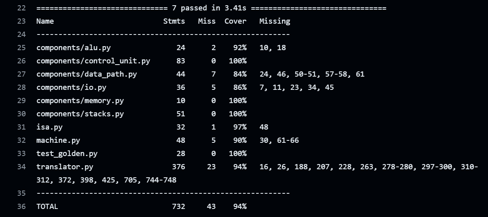

# Лабораторная №3. Эксперимент.

- Клиодт Вадим Дмитриевич, P3234
- Вариант: `lisp -> asm | stack | harv | hw | instr | struct | stream | port | cstr | prob2 | cache`
- Базовый вариант

## Язык программирования
### Синтаксис
Форма Бэкуса-Наура:
```BNF
<program> ::= {<expression_list>}

<expression_list> ::= <expression> | <expression> <expression_list>

<expression> ::= <defvar>
               | <setq>
               | <defun>
               | <loop_while>
               | <if>
               | <print_str>
               | <print_int>
               | <read_str>
               | <arithmetic_expr>
               | <comparison_expr>
               | <logical_expr>
               | <function_call>
               | <identifier>
               | <number>
               | <string>

<defvar> ::= "(defvar" <identifier> [<expression>] ")"

<setq> ::= "(setq" <identifier> <expression> ")"

<defun> ::= "(defun" <identifier> "(" <param_list> ")" <expression_list> ")"

<param_list> ::= <identifier> | <identifier> <param_list>

<loop_while> ::= "(loop_while" <expression> [<expression_list>] ")"

<if> ::= "(if" <expression> <expression> <expression> ")"

<print_str> ::= "(print_str" /<expression>/ ")"

<print_int> ::= "(print_int" <expression> ")"

<read_str> ::= "(read_str)"

<arithmetic_expr> ::= "(+" {<expression>} ")"
                    | "(-" /<expression>/ ")"
                    | "(*" {<expression>} ")"
                    | "(/" /<expression>/ ")"
                    | "(mod" <expression> <expression> ")"

<comparison_expr> ::= "(=" <expression> [<expression>] ")"
                    | "(>" <expression> [<expression>] ")"
                    | "(<" <expression> [<expression>] ")"

<logical_expr> ::= "(and" /<expression>/ ")"
                 | "(or" /<expression>/ ")"
                 | "(not" <expression> ")"

<function_call> ::= "(" <identifier> <expression_list> ")"

<identifier> ::= <letter> { <letter> | <digit> | "_" }

<string> ::= "\"" { <any_character_except_double_quote> } "\""

<number> ::= ["-"] <digit> { <digit> }

<letter> ::= "a" | "b" | ... | "z" | "A" | "B" | ... | "Z"

<digit> ::= "0" | "1" | "2" | ... | "9"

```

### Семантика
Комментарии:
- Начинаются со знака `#` и идут до конца строки.

Операции:
- `defvar` - объявление переменной и присваивание ей переданного значения или 0, если значения не передано. Все переменные имеют глобальную область видимости. Объявление переменной обязательно до других операций с ней. Возвращает значение переменной.
- `setq` - присвоить переменной значение. Возвращает значение переменной.
- `loop_while` - выполняет код в цикле, пока истинно условие. `(loop_while (A) (B) (C) (D) ...)` - означает `while (A) {B; C; D; ... }`. Возвращает ноль.
- `if` - условный оператор.  `(if (A) (B) (C))` - означает `if (A) {B} else {C}`. Возвращает значение выполненного выражения.
- `print_str` - выводит строку. Возвращает адрес последнего напечатанного символа.
- `pritn_char` - выводит переданный символ. Возвращает его же.
- `print_int` - выводит число. Возвращает ноль.
- `read_str` - читает строку. Возвращает указатель на ее начало.
- `+` `-` `*` `/` `mod` - арифметические операции (сложение, вычитание, умножение, целочисленное деление, взятие остатка). Возвращают свой результат.
-  `=` `>` `<` - операторы сравнения. Возвращают 1 или 0 (true/false соотв.)
- `and` `or` `not` - булевы операторы. and возвращает первое ложное, иначе, если такого нет, последнее. or возвращает первое истинное, иначе, если такого нет, последнее. not возвращает 1 или 0 (true/false соотв.)
- `defun` - объявление функции. Выполняется только при вызове. Вызов функции возвращает то, что вернуло последнее выражение в теле функции. 

Пример объявления и вызова функции: 
```lisp
(defun print_sum(a b) (print_int (+ a b)))
(print_sum 123 987)
```
Возможна рекурсия ([см. тест](golden/recursion.yml)): 
```lisp
(defun decrement_and_print(a)       # объявление функции и переменной а
    (if (< 0 a)                     # проверка условия
        (and                        # and используется для выполнения нескольких выражений в блоке
            (setq a (- a 1))        # декрементировать а
            (print_int a)           # напечатать а
            (print_str " ")         # напечатать пробел
            (decrement_and_print a) # рекурсивный вызов
        )
    0)                              # пустой блок else
)

(decrement_and_print 5)             # вызов функции

# Выводит: 4 3 2 1 0
```

Порядок выполнения: 
- Все операции выполняются последовательно. Сначала последовательно выполняются внутренние выражения, потом внешние. Например, для `(A (B) (C))` порядок будет B-C-A.

Литералы:
- Целые числовые. Возвращают себя.
- Строковые, пишутся в двойных кавычках, длина не ограничена. Возвращают указатель на место в памяти, где записаны.

Память: 
- Распределяется статически на этапе трансляции
- Строковые литералы помещаются в память в начале работы программы
- Под динамически считываемые строки в памяти выделяется буфер предустановленного размера (40 символов), строки считываются в этот буфер 

Видимость переменных и функций:
- Глобальная после их объявления

# Организация памяти
Модель памяти:
- Гарвардская архитектура - раздельная память команд и данных
- Размер машинного слова не определён
- Размер памяти данных задается при начале симуляции 
- Имеет линейное адресное пространство
- В памяти данных хранятся статические строки и переменных
- В памяти команд хранятся инструкции для выполнения
- Взаимодействие с памятью данных происходит при помощи инструкций `LOAD` и `STORE`. LOAD - загружает в вершину стека данные по адресу с вершины стека. STORE - сохраняет данные в память из второй ячейки стека по адресу с вершины стека.

Стеки:
- Имеются стек данных и стек возвратов (в соответствии со стековой моделью процессора)
- Оба поддерживают операции `push` и `pop`
- Стек данных поддерживает операции `dup` и `swap`, а также чтение из второй от вершины ячейки (предполагается реализация на уровне схемотехники)

Регистры:
- PC - счетчик команд
- AR - регистр адреса

# Система команд
## Набор инструкций

| Команда                                                         | Число тактов | Стек ДО                                                                           | Стек ПОСЛЕ                                                                         | Описание                                                                                                                                                                                           |
|:----------------------------------------------------------------|--------------|:----------------------------------------------------------------------------------|------------------------------------------------------------------------------------|:---------------------------------------------------------------------------------------------------------------------------------------------------------------------------------------------------|
| PUSH [value]                                                    | 1            | <table><tr><td>...</td></tr><tr><td>...</td></tr><tr><td>...</td></tr></table>    | <table><tr><td>...</td></tr><tr><td>...</td></tr><tr><td>value</td></tr></table>   | пушит на вершину стека свой аргумент                                                                                                                                                               |
| LOAD                                                            | 2            | <table><tr><td>...</td></tr><tr><td>...</td></tr><tr><td>addr</td></tr></table>   | <table><tr><td>...</td></tr><tr><td>...</td></tr><tr><td>value</td></tr></table>   | загружает значение из памяти, адрес берется из вершины стека                                                                                                                                       |
| STORE                                                           | 2            | <table><tr><td>...</td></tr><tr><td>value</td></tr><tr><td>addr</td></tr></table> | <table><tr><td>...</td></tr><tr><td>...</td></tr><tr><td>value</td></tr></table>   | сохраняет значение из второй ячейки стека, адрес берется из вершины стека                                                                                                                          |
| POP                                                             | 1            | <table><tr><td>...</td></tr><tr><td>...</td></tr><tr><td>value</td></tr></table>  | <table><tr><td>...</td></tr><tr><td>...</td></tr><tr><td>...</td></tr></table>     | удаляет вершину стека                                                                                                                                                                              |
| ADD<br/>SUB<br/>MUL<br/>DIV<br/>MOD                             | 1            | <table><tr><td>...</td></tr><tr><td>a</td></tr><tr><td>b</td></tr></table>        | <table><tr><td>...</td></tr><tr><td>...</td></tr><tr><td>result</td></tr></table>  | выполняет арифметическую операцию                                                                                                                                                                  |
| FLAGS                                                           | 1            | <table><tr><td>...</td></tr><tr><td>...</td></tr><tr><td>value</td></tr></table>  | <table><tr><td>...</td></tr><tr><td>...</td></tr><tr><td>value</td></tr></table>   | выставляет флаги `N` (negative) и `Z` (zero) для value                                                                                                                                             |
| INC<br/>DEC                                                     | 1            | <table><tr><td>...</td></tr><tr><td>...</td></tr><tr><td>value</td></tr></table>  | <table><tr><td>...</td></tr><tr><td>...</td></tr><tr><td>result</td></tr></table>  | выполняет инкремент или декремент                                                                                                                                                                  |
| READ [port]                                                     | 1            | <table><tr><td>...</td></tr><tr><td>...</td></tr><tr><td>...</td></tr></table>    | <table><tr><td>...</td></tr><tr><td>...</td></tr><tr><td>value</td></tr></table>   | читает из порта один символ                                                                                                                                                                        |
| WRITE [port]                                                    | 1            | <table><tr><td>...</td></tr><tr><td>...</td></tr><tr><td>value</td></tr></table>  | <table><tr><td>...</td></tr><tr><td>...</td></tr><tr><td>...</td></tr></table>     | записывает вершину стека в порт                                                                                                                                                                    |
| DUP                                                             | 1            | <table><tr><td>...</td></tr><tr><td>...</td></tr><tr><td>value</td></tr></table>  | <table><tr><td>...</td></tr><tr><td>value</td></tr><tr><td>value</td></tr></table> | дублирует значение с вершины стека                                                                                                                                                                 |
| SWAP                                                            | 1            | <table><tr><td>...</td></tr><tr><td>a</td></tr><tr><td>b</td></tr></table>        | <table><tr><td>...</td></tr><tr><td>b</td></tr><tr><td>a</td></tr></table>         | меняет местами верхние 2 значения в стеке                                                                                                                                                          |
| JUMP [len]<br/>JZ [len]<br/>JNZ [len]<br/>JP [len]<br/>JM [len] | 1            | -                                                                                 | -                                                                                  | прыжок на расстояние `len` на основании выставленных флагов. <br/>`JUMP` - безусловный, <br/>`JZ` - прыжок, если ноль, <br/>`JNZ` - прыжок, если не ноль, <br/>`JP`/`JM` - прыжок, если плюс/минус |
| CALL [addr]                                                     | 1            | -                                                                                 | -                                                                                  | вызов функции по адресу addr                                                                                                                                                                       |
| RET                                                             | 1            | -                                                                                 | -                                                                                  | возврат из функции                                                                                                                                                                                 |
| HALT                                                            | 1            | -                                                                                 | -                                                                                  | остановить выполнение                                                                                                                                                                              |


## Формат инструкций
Инструкции представлены в формате _JSON_ по заданию
```json
{
  "opcode": "push",
  "arg": 123,
  "term": "defvar"
}
```
где:
- `opcode` - код операции (Opcode - тип данных, определенный в [isa](isa.py))
- `arg` - аргумент инструкции
- `term` - указывает на то, к какой части исходного кода относится инструкция

# Транслятор
Интерфейс командной строки: `python translator.py <input_file> <target_file>`

Транслятор реализован в модуле [translator](translator.py)

Этапы трансляции:
1. удаление комментариев
2. определение строковых литералов и замена их на заглушки
3. форматирование программы (удаление двойных пробелов и пр.)
4. парсинг программы: исходный код представляется как вложенные объекты класса `Expression` (определен в [translator](translator.py), попутная проверка на корректность скобочной последовательности)
5. генерация машинного кода на основе объектов `Expression`, попутная проверка корректности использования синтаксических конструкций языка
6. сериализация - представление в формате _JSON_

# Модель процессора

Интерфейс командной строки:  `python machine.py <machine_code_file> <input_file> <output_file>`

Реализовано в [machine](machine.py) и [components](components).

## DataPath


Реализован в [data_path](components/data_path.py)

Сигналы (обрабатываются за один такт, реализованы в виде методов класса)
- `latch_data_addr` - защёлкнуть значение в data_addr
- `latch_tos` - защёлкнуть вершину стека
- `store` / `load` - сигналы записи / чтения памяти данных
- `operation` - сигнал, определяющий операцию алу
- `read` / `write` / `port` - сигналы чтения / записи / порта устройства ввода вывода

Флаги:
- `Z` - zero - отражает нулевое значение в вершине стека
- `N` - negative - отражает отрицательное значение в вершине стека

## ControlUnit


Реализован в [control_unit](components/control_unit.py)
- hardwired - внутренняя логика дешифратора инструкций скрыта. В данной модели реализована на Python
- Метод `decode_and_execute_instruction` моделирует выполнение полного цикла инструкции 
- `tick_counter` - имитирует работу счетчика тактов

Сигналы: 
- `latch_program_counter` - защелкнуть значение в program_counter
- `read` - чтение из памяти инструкций

Особенности работы модели:
- Цикл симуляции осуществляется в функции `simulation`
- Шаг моделирования соответствует одной инструкции с выводом состояния в журнал
- Для журнала состояний процессора используется стандартный модуль `logging`
- Остановка модели осуществляется при следующих условиях:
  - достижение инструкции halt
  - переполнение стека или чтение из пустого стека
  - отсутствие данных для чтения из порта ввода
  - чтение или запись в несуществующий адрес памяти

# Тестирование
Тестирование выполняется при помощи golden test-ов.
- Конфигурация лежит в директории [golden](golden)

GitHub Actions при совершении `push`-а автоматически
- запускает golden-тесты (задание `test`)
- проверяет форматирование и запускает линтеры (задание `lint`)

Конфигурация для GitHub Actions находится в файле [main.yaml](.github/workflows/main.yaml)

Результаты тестирования:


Алгоритмы согласно варианту:
- [hello_world](golden/hello_world.yml)
- [cat](golden/cat.yml)
- [hello_user](golden/hello_user.yml)
- [prob2](golden/prob2.yml)

Дополнительные алгоритмы:
- [rhombus (РОМБ)](golden/rhombus.yml) - функция, которая печатает РОМБ со стороной длины n из символов sym (демонстрация возможностей языка)
- [every_statement_expression](golden/every_statement_expression.yml) - демонстрация, что любое выражение (statement) - expression
- [recursion](golden/recursion.yml) - демонстрация рекурсии

Исходный код, результат компиляции и журнал работы для программы `cat` (Ввод: ABCD):
```lisp
(defvar a)
(loop_while (setq a (read_char))
    (print_char a)
)
```
Определяется переменная `a`, в нее считывается символ из потока ввода. Пока значение не нулевое, происходит печать `a` 
в поток вывода. Как только будет введен `\0`, программа прекратит печать и завершится. Нулевое значение не будет напечатано.
```json
[
  { "opcode": "push",   "arg": 0,   "term": "defvar" }, 
  { "opcode": "push",   "arg": 1,   "term": "defvar" }, 
  { "opcode": "store",   "arg": null,   "term": "defvar" }, 
  { "opcode": "pop",   "arg": null,   "term": "(top-level expression)" }, 
  { "opcode": "read",   "arg": 0,   "term": "read_char" }, 
  { "opcode": "push",   "arg": 1,   "term": "setq" }, 
  { "opcode": "store",   "arg": null,   "term": "setq" }, 
  { "opcode": "flags",   "arg": null,   "term": "loop_while" }, 
  { "opcode": "pop",   "arg": null,   "term": "loop_while" }, 
  { "opcode": "jump_zero",   "arg": 6,   "term": "loop_while" }, 
  { "opcode": "push",   "arg": 1,   "term": "(variable: a)" }, 
  { "opcode": "load",   "arg": null,   "term": "(variable: a)" }, 
  { "opcode": "dup",   "arg": null,   "term": "print_char" }, 
  { "opcode": "write",   "arg": 0,   "term": "print_char" }, 
  { "opcode": "pop",   "arg": null,   "term": "loop_while" }, 
  { "opcode": "jump",   "arg": -12,   "term": "loop_while" }, 
  { "opcode": "push",   "arg": 0,   "term": "loop_while" }, 
  { "opcode": "pop",   "arg": null,   "term": "(top-level expression)" }, 
  { "opcode": "halt",   "arg": null,   "term": null } 
] 
```
``` none
DEBUG:root:TICK:   0,  PC:   0,  AR:   0,  MEM_OUT:   0,  TOS: []                    ,    push 0     // defvar
DEBUG:root:TICK:   1,  PC:   1,  AR:   0,  MEM_OUT:   0,  TOS: [0]                   ,    push 1     // defvar
DEBUG:root:TICK:   2,  PC:   2,  AR:   0,  MEM_OUT:   0,  TOS: [1, 0]                ,    store      // defvar
DEBUG:root:TICK:   4,  PC:   3,  AR:   1,  MEM_OUT:   0,  TOS: [0]                   ,    pop        // (top-level expression)
DEBUG:root:TICK:   5,  PC:   4,  AR:   1,  MEM_OUT:   0,  TOS: []                    ,    read 0     // read_char
DEBUG:root:ввод: A
DEBUG:root:TICK:   6,  PC:   5,  AR:   1,  MEM_OUT:   0,  TOS: [65]                  ,    push 1     // setq
DEBUG:root:TICK:   7,  PC:   6,  AR:   1,  MEM_OUT:   0,  TOS: [1, 65]               ,    store      // setq
DEBUG:root:TICK:   9,  PC:   7,  AR:   1,  MEM_OUT:  65,  TOS: [65]                  ,    flags      // loop_while
DEBUG:root:TICK:  10,  PC:   8,  AR:   1,  MEM_OUT:  65,  TOS: [65]                  ,    pop        // loop_while
DEBUG:root:TICK:  11,  PC:   9,  AR:   1,  MEM_OUT:  65,  TOS: []                    ,    jump_zero 6 // loop_while
DEBUG:root:TICK:  12,  PC:  10,  AR:   1,  MEM_OUT:  65,  TOS: []                    ,    push 1     // (variable: a)
DEBUG:root:TICK:  13,  PC:  11,  AR:   1,  MEM_OUT:  65,  TOS: [1]                   ,    load       // (variable: a)
DEBUG:root:TICK:  15,  PC:  12,  AR:   1,  MEM_OUT:  65,  TOS: [65]                  ,    dup        // print_char
DEBUG:root:TICK:  16,  PC:  13,  AR:   1,  MEM_OUT:  65,  TOS: [65, 65]              ,    write 0    // print_char
DEBUG:root:вывод: A
DEBUG:root:TICK:  17,  PC:  14,  AR:   1,  MEM_OUT:  65,  TOS: [65]                  ,    pop        // loop_while
DEBUG:root:TICK:  18,  PC:  15,  AR:   1,  MEM_OUT:  65,  TOS: []                    ,    jump -12   // loop_while
DEBUG:root:TICK:  19,  PC:   4,  AR:   1,  MEM_OUT:  65,  TOS: []                    ,    read 0     // read_char
DEBUG:root:ввод: B
DEBUG:root:TICK:  20,  PC:   5,  AR:   1,  MEM_OUT:  65,  TOS: [66]                  ,    push 1     // setq
DEBUG:root:TICK:  21,  PC:   6,  AR:   1,  MEM_OUT:  65,  TOS: [1, 66]               ,    store      // setq
DEBUG:root:TICK:  23,  PC:   7,  AR:   1,  MEM_OUT:  66,  TOS: [66]                  ,    flags      // loop_while
DEBUG:root:TICK:  24,  PC:   8,  AR:   1,  MEM_OUT:  66,  TOS: [66]                  ,    pop        // loop_while
DEBUG:root:TICK:  25,  PC:   9,  AR:   1,  MEM_OUT:  66,  TOS: []                    ,    jump_zero 6 // loop_while
DEBUG:root:TICK:  26,  PC:  10,  AR:   1,  MEM_OUT:  66,  TOS: []                    ,    push 1     // (variable: a)
DEBUG:root:TICK:  27,  PC:  11,  AR:   1,  MEM_OUT:  66,  TOS: [1]                   ,    load       // (variable: a)
DEBUG:root:TICK:  29,  PC:  12,  AR:   1,  MEM_OUT:  66,  TOS: [66]                  ,    dup        // print_char
DEBUG:root:TICK:  30,  PC:  13,  AR:   1,  MEM_OUT:  66,  TOS: [66, 66]              ,    write 0    // print_char
DEBUG:root:вывод: B
DEBUG:root:TICK:  31,  PC:  14,  AR:   1,  MEM_OUT:  66,  TOS: [66]                  ,    pop        // loop_while
DEBUG:root:TICK:  32,  PC:  15,  AR:   1,  MEM_OUT:  66,  TOS: []                    ,    jump -12   // loop_while
DEBUG:root:TICK:  33,  PC:   4,  AR:   1,  MEM_OUT:  66,  TOS: []                    ,    read 0     // read_char
DEBUG:root:ввод: C
DEBUG:root:TICK:  34,  PC:   5,  AR:   1,  MEM_OUT:  66,  TOS: [67]                  ,    push 1     // setq
DEBUG:root:TICK:  35,  PC:   6,  AR:   1,  MEM_OUT:  66,  TOS: [1, 67]               ,    store      // setq
DEBUG:root:TICK:  37,  PC:   7,  AR:   1,  MEM_OUT:  67,  TOS: [67]                  ,    flags      // loop_while
DEBUG:root:TICK:  38,  PC:   8,  AR:   1,  MEM_OUT:  67,  TOS: [67]                  ,    pop        // loop_while
DEBUG:root:TICK:  39,  PC:   9,  AR:   1,  MEM_OUT:  67,  TOS: []                    ,    jump_zero 6 // loop_while
DEBUG:root:TICK:  40,  PC:  10,  AR:   1,  MEM_OUT:  67,  TOS: []                    ,    push 1     // (variable: a)
DEBUG:root:TICK:  41,  PC:  11,  AR:   1,  MEM_OUT:  67,  TOS: [1]                   ,    load       // (variable: a)
DEBUG:root:TICK:  43,  PC:  12,  AR:   1,  MEM_OUT:  67,  TOS: [67]                  ,    dup        // print_char
DEBUG:root:TICK:  44,  PC:  13,  AR:   1,  MEM_OUT:  67,  TOS: [67, 67]              ,    write 0    // print_char
DEBUG:root:вывод: C
DEBUG:root:TICK:  45,  PC:  14,  AR:   1,  MEM_OUT:  67,  TOS: [67]                  ,    pop        // loop_while
DEBUG:root:TICK:  46,  PC:  15,  AR:   1,  MEM_OUT:  67,  TOS: []                    ,    jump -12   // loop_while
DEBUG:root:TICK:  47,  PC:   4,  AR:   1,  MEM_OUT:  67,  TOS: []                    ,    read 0     // read_char
DEBUG:root:ввод: D
DEBUG:root:TICK:  48,  PC:   5,  AR:   1,  MEM_OUT:  67,  TOS: [68]                  ,    push 1     // setq
DEBUG:root:TICK:  49,  PC:   6,  AR:   1,  MEM_OUT:  67,  TOS: [1, 68]               ,    store      // setq
DEBUG:root:TICK:  51,  PC:   7,  AR:   1,  MEM_OUT:  68,  TOS: [68]                  ,    flags      // loop_while
DEBUG:root:TICK:  52,  PC:   8,  AR:   1,  MEM_OUT:  68,  TOS: [68]                  ,    pop        // loop_while
DEBUG:root:TICK:  53,  PC:   9,  AR:   1,  MEM_OUT:  68,  TOS: []                    ,    jump_zero 6 // loop_while
DEBUG:root:TICK:  54,  PC:  10,  AR:   1,  MEM_OUT:  68,  TOS: []                    ,    push 1     // (variable: a)
DEBUG:root:TICK:  55,  PC:  11,  AR:   1,  MEM_OUT:  68,  TOS: [1]                   ,    load       // (variable: a)
DEBUG:root:TICK:  57,  PC:  12,  AR:   1,  MEM_OUT:  68,  TOS: [68]                  ,    dup        // print_char
DEBUG:root:TICK:  58,  PC:  13,  AR:   1,  MEM_OUT:  68,  TOS: [68, 68]              ,    write 0    // print_char
DEBUG:root:вывод: D
DEBUG:root:TICK:  59,  PC:  14,  AR:   1,  MEM_OUT:  68,  TOS: [68]                  ,    pop        // loop_while
DEBUG:root:TICK:  60,  PC:  15,  AR:   1,  MEM_OUT:  68,  TOS: []                    ,    jump -12   // loop_while
DEBUG:root:TICK:  61,  PC:   4,  AR:   1,  MEM_OUT:  68,  TOS: []                    ,    read 0     // read_char
DEBUG:root:ввод: \0
DEBUG:root:TICK:  62,  PC:   5,  AR:   1,  MEM_OUT:  68,  TOS: [0]                   ,    push 1     // setq
DEBUG:root:TICK:  63,  PC:   6,  AR:   1,  MEM_OUT:  68,  TOS: [1, 0]                ,    store      // setq
DEBUG:root:TICK:  65,  PC:   7,  AR:   1,  MEM_OUT:   0,  TOS: [0]                   ,    flags      // loop_while
DEBUG:root:TICK:  66,  PC:   8,  AR:   1,  MEM_OUT:   0,  TOS: [0]                   ,    pop        // loop_while
DEBUG:root:TICK:  67,  PC:   9,  AR:   1,  MEM_OUT:   0,  TOS: []                    ,    jump_zero 6 // loop_while
DEBUG:root:TICK:  68,  PC:  16,  AR:   1,  MEM_OUT:   0,  TOS: []                    ,    push 0     // loop_while
DEBUG:root:TICK:  69,  PC:  17,  AR:   1,  MEM_OUT:   0,  TOS: [0]                   ,    pop        // (top-level expression)
DEBUG:root:TICK:  70,  PC:  18,  AR:   1,  MEM_OUT:   0,  TOS: []                    ,    halt      

program counter: 18, ticks: 70.
Вывод:
ABCD
```

Статистика по алгоритмам:
```none
| ФИО                     | алг   | LoC | code байт | code инстр. | инстр. | такт. | вариант                                                                                 |
| Клиодт Вадим Дмитриевич | hello | 1   | -         | 60          | 134    | 157   | lisp -> asm | stack | harv | hw | instr | struct | stream | port | cstr | prob2 | cache |
| Клиодт Вадим Дмитриевич | cat   | 4   | -         | 20          | 239    | 239   | lisp -> asm | stack | harv | hw | instr | struct | stream | port | cstr | prob2 | cache |
| Клиодт Вадим Дмитриевич | prob2 | 14  | -         | 101         | 1683   | 2003  | lisp -> asm | stack | harv | hw | instr | struct | stream | port | cstr | prob2 | cache |
```


